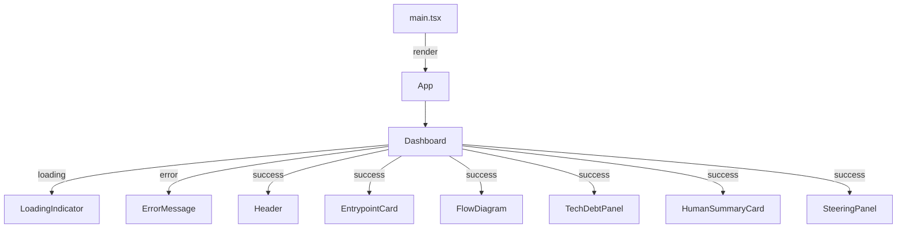

# Design Document: Repo Archaeologist Dashboard

## Overview

The Repo Archaeologist Dashboard is a single-page React application that visualises the output of a
repository scan. It renders structured data — entrypoint, tech stack, architectural flow, tech debt
signals, a plain-English summary, and a Kiro Steering export — in a dark-themed, responsive layout.

The application is fully standalone. A static TypeScript mock data module (`data/mock-data.ts`)
exports typed scan data, consumed through an API abstraction layer (`data/api.ts`) that can be
toggled to call a real backend when ready. No external service worker or network interception is
required during development.

**Key technology choices:**

| Concern | Choice | Rationale |
|---------|--------|-----------|
| Framework | React 19 + TypeScript | Already scaffolded; strong typing for ScanData |
| Build | Vite 8 | Already configured; fast HMR for development |
| Styling | Tailwind CSS 4 (via `@tailwindcss/vite`) | Already installed; utility-first matches dark-theme requirement |
| Mock Data | Static TypeScript module (`data/mock-data.ts`) | Simple, no service worker; easy toggle to real backend API |
| Testing | Vitest + React Testing Library | Standard Vite-native test stack; fast-check for property tests |

---

## Architecture

### High-Level Data Flow

```mermaid
graph LR
    A[mock-data.ts / Real API] -->|fetchScanData()| B[useScanData hook]
    B -->|parse + validate| C[ScanData object]
    C --> D[Component Tree]
```

### Component Tree



### Startup Sequence

1. `main.tsx` renders `<App />` directly (no mocking setup needed).
2. `App` renders `Dashboard`, which triggers `fetchScanData()` via the `useScanData` hook.
3. `fetchScanData()` returns mock data (or calls real API when `USE_MOCK` is flipped to `false`).
4. The hook manages three states: `loading`, `error`, and `success` (with typed `ScanData`).
5. `Dashboard` conditionally renders the appropriate UI based on fetch state.

---

## Components and Interfaces

### File / Folder Structure

```
frontend/src/
├── main.tsx                    # Entry: render App directly
├── App.tsx                     # Root component, renders Dashboard
├── index.css                   # Tailwind import (existing)
├── types/
│   └── scan-data.ts            # ScanData interface and related types
├── data/
│   ├── mock-data.ts            # MOCK_SCAN_DATA constant (exact scan fixture)
│   └── api.ts                  # fetchScanData() — mock toggle, real API ready
├── hooks/
│   └── useScanData.ts          # Custom hook: calls fetchScanData + state management
├── utils/
│   └── format.ts               # formatScanDate, formatPercentage, truncateText
├── components/
│   ├── Dashboard.tsx           # Orchestrator: loading/error/success routing
│   ├── LoadingIndicator.tsx    # Spinner or skeleton shown during fetch
│   ├── ErrorMessage.tsx        # Error display with human-readable message
│   ├── Header.tsx              # Repo name, timestamp, tokens-saved badge
│   ├── EntrypointCard.tsx      # Entrypoint file + inferred stack
│   ├── FlowDiagram.tsx         # Sequential pipeline of flow nodes
│   ├── TechDebtPanel.tsx       # List of debt items with severity colouring
│   ├── HumanSummaryCard.tsx    # Plain-English summary card
│   └── SteeringPanel.tsx       # Kiro steering markdown + copy button
└── __tests__/
    ├── properties/
    │   ├── isScanData.property.test.ts
    │   ├── formatDate.property.test.ts
    │   ├── formatPercentage.property.test.ts
    │   ├── truncateText.property.test.ts
    │   ├── FlowDiagram.property.test.tsx
    │   └── TechDebtPanel.property.test.tsx
    ├── components/
    │   ├── Dashboard.test.tsx
    │   ├── Header.test.tsx
    │   ├── EntrypointCard.test.tsx
    │   ├── FlowDiagram.test.tsx
    │   ├── TechDebtPanel.test.tsx
    │   ├── HumanSummaryCard.test.tsx
    │   └── SteeringPanel.test.tsx
    └── integration/
        └── fetchCycle.test.tsx
```

### Component Interfaces (Props)

```typescript
// Dashboard.tsx — no props, manages its own state via useScanData hook

// Header.tsx
interface HeaderProps {
  repoName: string;
  scannedAt: string;               // ISO 8601
  tokensSavedPercentage: number | null;
}

// EntrypointCard.tsx
interface EntrypointCardProps {
  entrypoint: string;
  inferredStack: string;
}

// FlowDiagram.tsx
interface FlowDiagramProps {
  flow: string[];
}

// TechDebtPanel.tsx
interface TechDebtPanelProps {
  techDebt: DebtItem[];
}

// HumanSummaryCard.tsx
interface HumanSummaryCardProps {
  humanSummary: string;
}

// SteeringPanel.tsx
interface SteeringPanelProps {
  kiroSteering: string;
}

// ErrorMessage.tsx
interface ErrorMessageProps {
  message: string;
}
```

### `useScanData` Hook

```typescript
type ScanDataState =
  | { status: 'loading' }
  | { status: 'error'; message: string }
  | { status: 'success'; data: ScanData };

function useScanData(): ScanDataState;
```

The hook:
1. Calls `fetchScanData()` on mount via `useEffect`.
2. The API layer handles validation (type guard check when using real API).
3. Transitions state from `loading` → `success` or `loading` → `error`.

### Mock Data Layer

**`src/data/mock-data.ts`**
```typescript
import { ScanData } from '../types/scan-data';

export const MOCK_SCAN_DATA: ScanData = {
  "repoName": "expressjs/express",
  "scannedAt": "2026-08-15T10:30:00Z",
  "tokensSavedPercentage": 84,
  "entrypoint": "src/server.ts",
  "inferredStack": "Node.js / Express API",
  "flow": ["Express API", "JWT Middleware (src/middlewares/auth.ts)", "Prisma ORM", "PostgreSQL"],
  "techDebt": [
    { "type": "monolith", "severity": "high", "file": "src/controllers/billing.ts", "details": "1,420 lines — high fragility risk" },
    { "type": "stale_todo", "severity": "medium", "file": "src/routes/api.ts:44", "details": "// TODO: fix race condition in webhook (added 412 days ago)" },
    { "type": "unused_dep", "severity": "low", "file": "package.json", "details": "3 dead packages detected: 'moment', 'lodash', 'axios'" }
  ],
  "humanSummary": "Start onboarding at src/server.ts. Billing logic is heavily monolithic—avoid refactoring it directly. JWT authentication is handled in src/middlewares/auth.ts. Use native fetch instead of legacy axios.",
  "kiroSteering": "# Kiro Steering: Repository Archaeology Context\n\n## Architecture Summary\n- **Entrypoint:** `src/server.ts`\n- **Pattern:** Express REST Controller -> Prisma ORM -> PostgreSQL\n- **Auth Guard:** `src/middlewares/auth.ts`\n\n## Constraints & Fragile Zones\n- **DO NOT Refactor:** `src/controllers/billing.ts` (1,420-line legacy monolith). Extend via isolated helpers only.\n- **Dead Dependencies:** Avoid referencing `moment` or `axios`; project has transitioned to native `fetch`."
};
```

**`src/data/api.ts`**
```typescript
import { ScanData, isScanData } from '../types/scan-data';
import { MOCK_SCAN_DATA } from './mock-data';

const USE_MOCK = true; // Toggle to false when backend is ready

export async function fetchScanData(): Promise<ScanData> {
  if (USE_MOCK) {
    await new Promise(resolve => setTimeout(resolve, 500));
    return MOCK_SCAN_DATA;
  }

  const response = await fetch('/api/data');
  if (!response.ok) {
    throw new Error(`Server returned ${response.status}`);
  }
  const data = await response.json();
  if (!isScanData(data)) {
    throw new Error('Response format is invalid');
  }
  return data;
}
```

**`main.tsx`**
```typescript
import { StrictMode } from 'react';
import { createRoot } from 'react-dom/client';
import './index.css';
import App from './App';

createRoot(document.getElementById('root')!).render(
  <StrictMode>
    <App />
  </StrictMode>,
);
```

---

## Data Models

### `ScanData` Interface

```typescript
// src/types/scan-data.ts

export interface DebtItem {
  type: string;
  severity: string;       // 'high' | 'medium' | 'low' or unknown
  file: string;
  details: string;
}

export interface ScanData {
  repoName: string;
  scannedAt: string;                // ISO 8601 date-time
  tokensSavedPercentage: number;    // 0–100 inclusive
  entrypoint: string;
  inferredStack: string;
  flow: string[];
  techDebt: DebtItem[];
  humanSummary: string;
  kiroSteering: string;
}
```

### Runtime Validation

A lightweight `isScanData(value: unknown): value is ScanData` type guard validates the shape at
runtime. This is preferred over pulling in a schema library (e.g. Zod) to keep the bundle minimal —
the only consumer is the API abstraction layer when calling the real backend.

```typescript
export function isScanData(value: unknown): value is ScanData {
  if (typeof value !== 'object' || value === null) return false;
  const obj = value as Record<string, unknown>;
  return (
    typeof obj.repoName === 'string' &&
    typeof obj.scannedAt === 'string' &&
    typeof obj.tokensSavedPercentage === 'number' &&
    typeof obj.entrypoint === 'string' &&
    typeof obj.inferredStack === 'string' &&
    Array.isArray(obj.flow) &&
    obj.flow.every((item) => typeof item === 'string') &&
    Array.isArray(obj.techDebt) &&
    obj.techDebt.every(isDebtItem) &&
    typeof obj.humanSummary === 'string' &&
    typeof obj.kiroSteering === 'string'
  );
}

function isDebtItem(value: unknown): value is DebtItem {
  if (typeof value !== 'object' || value === null) return false;
  const obj = value as Record<string, unknown>;
  return (
    typeof obj.type === 'string' &&
    typeof obj.severity === 'string' &&
    typeof obj.file === 'string' &&
    typeof obj.details === 'string'
  );
}
```

### Tailwind Dark Theme Strategy

The Dashboard uses Tailwind's utility classes exclusively (Requirement 10.3). No custom CSS or
inline styles.

| Surface | Class | Purpose |
|---------|-------|---------|
| Page root | `bg-gray-900 text-gray-100` | Dark background, light text |
| Cards/Panels | `bg-gray-800 rounded-lg border border-gray-700` | Elevated surfaces |
| Section titles | `text-lg font-semibold text-white` | Typographic hierarchy tier 1 |
| Labels | `text-sm text-gray-400` | Tier 2 |
| Body text | `text-base text-gray-300` | Tier 3 |
| Monospace | `font-mono text-sm` | Entrypoint, file paths, steering code |
| Badge (tokens saved) | `bg-emerald-600 text-white text-sm px-2 py-0.5 rounded` | Contrasting badge |

### Responsive Layout Approach

Tailwind's responsive prefix `md:` corresponds to the 768px breakpoint (matching Requirement 9).

- **< 768px (mobile):** Single-column stack. All cards use `w-full`.
- **≥ 768px (desktop):** Multi-column grid. `EntrypointCard` and `HumanSummaryCard` sit
  side-by-side using `md:grid-cols-2` on a parent grid container.

Layout classes on the main content wrapper:

```html
<div class="grid grid-cols-1 md:grid-cols-2 gap-6">
  <!-- EntrypointCard: col-span-1 -->
  <!-- HumanSummaryCard: col-span-1 -->
  <!-- Full-width sections: md:col-span-2 -->
</div>
```

Full-width sections (Header, FlowDiagram, TechDebtPanel, SteeringPanel) span both columns
via `md:col-span-2`.

---

## Correctness Properties

*A property is a characteristic or behavior that should hold true across all valid executions of a
system — essentially, a formal statement about what the system should do. Properties serve as the
bridge between human-readable specifications and machine-verifiable correctness guarantees.*

### Property 1: Type guard accepts all valid ScanData shapes

*For any* object that has all required fields with correct types (repoName: string, scannedAt:
string, tokensSavedPercentage: number, entrypoint: string, inferredStack: string, flow: string[],
techDebt: DebtItem[], humanSummary: string, kiroSteering: string), `isScanData` SHALL return `true`.
Conversely, *for any* object missing at least one required field or having a field with the wrong
type, `isScanData` SHALL return `false`.

**Validates: Requirements 2.2, 2.3**

### Property 2: Date formatting produces correct pattern

*For any* valid ISO 8601 date-time string, the `formatScanDate` function SHALL produce a string
matching the pattern `DD Month YYYY, HH:MM:SS` where DD is a zero-padded day (01–31), Month is a
full English month name, YYYY is a four-digit year, and HH:MM:SS is a zero-padded 24-hour time.

**Validates: Requirements 3.2**

### Property 3: Percentage clamping and rounding

*For any* numeric value, the `formatPercentage` function SHALL return an integer. If the input is
less than 0, the output SHALL be 0. If the input is greater than 100, the output SHALL be 100.
Otherwise, the output SHALL be `Math.round(input)`.

**Validates: Requirements 3.3**

### Property 4: Text truncation preserves content within limit

*For any* string `s` and positive integer limit `n`, the `truncateText(s, n)` function SHALL return
a string whose length does not exceed `n`. If `s.length <= n`, the output SHALL equal `s` exactly.
If `s.length > n`, the output SHALL be the first `n` characters of `s` (or fewer to account for a
truncation indicator).

**Validates: Requirements 4.1, 4.2, 7.5**

### Property 5: Flow diagram renders correct number of nodes with matching labels

*For any* non-empty array of strings, `FlowDiagram` SHALL render exactly `array.length` node
elements, and the text content of the i-th node SHALL equal `array[i]`.

**Validates: Requirements 5.1, 5.2, 5.4**

### Property 6: Flow diagram connector count equals nodes minus one

*For any* array of strings with length N ≥ 1, `FlowDiagram` SHALL render exactly `N - 1` connector
(arrow) elements between consecutive nodes.

**Validates: Requirements 5.3, 5.6**

### Property 7: Tech debt panel renders all items with required content

*For any* non-empty array of `DebtItem` objects, `TechDebtPanel` SHALL render exactly
`array.length` row elements, and each row SHALL contain the corresponding item's `type`, `file`,
and `details` text content.

**Validates: Requirements 6.1, 6.6, 6.7, 6.8**

---

## Error Handling

### Error Sources and Responses

| Error Source | Condition | User-Facing Behaviour |
|---|---|---|
| Mock toggle off | `USE_MOCK=false` but backend unavailable | Same fetch error handling: "Failed to load scan data: network error" |
| Network failure | `fetch('/api/data')` rejects | Display error: "Failed to load scan data: network error" |
| Non-200 response | Status ≠ 200 | Display error: "Failed to load scan data: server returned {status}" |
| Invalid response body | `isScanData` returns false | Display error: "Failed to load scan data: response format is invalid" |
| Missing optional fields | `entrypoint`, `inferredStack`, `humanSummary`, or `kiroSteering` is empty string | Component renders placeholder text (not an error state) |
| Clipboard API failure | `navigator.clipboard.writeText` rejects or is unavailable | Inline error on SteeringPanel: "Copy failed — clipboard unavailable" |

### Error State Design

The `ErrorMessage` component renders a centered card with:
- A warning icon (using an inline SVG from `public/icons.svg`)
- The error message text in `text-red-400`
- A "Retry" button that re-triggers the fetch (re-mounts Dashboard)

### Graceful Degradation

- Empty `flow` array → placeholder message, no crash
- Empty `techDebt` array → "No tech debt signals detected"
- Empty strings in individual fields → placeholder per field
- Unknown `severity` values → row renders without colour scheme (no crash)
- `tokensSavedPercentage` null → badge shows "N/A"

---

## Testing Strategy

### Test Stack

| Tool | Purpose |
|------|---------|
| Vitest | Test runner (Vite-native, fast) |
| React Testing Library | Component rendering and assertions |
| fast-check | Property-based testing (generates random inputs) |

### Test Categories

#### 1. Property-Based Tests (fast-check)

Each property from the Correctness Properties section gets a single property-based test with a
minimum of 100 iterations.

| Test | Property | Tag |
|------|----------|-----|
| `isScanData` accepts valid / rejects invalid | Property 1 | Feature: repo-archaeologist-dashboard, Property 1: Type guard accepts all valid ScanData shapes |
| Date formatter output matches pattern | Property 2 | Feature: repo-archaeologist-dashboard, Property 2: Date formatting produces correct pattern |
| Percentage formatter clamps and rounds | Property 3 | Feature: repo-archaeologist-dashboard, Property 3: Percentage clamping and rounding |
| Truncation respects limit | Property 4 | Feature: repo-archaeologist-dashboard, Property 4: Text truncation preserves content within limit |
| FlowDiagram node count and labels | Property 5 | Feature: repo-archaeologist-dashboard, Property 5: Flow diagram renders correct number of nodes |
| FlowDiagram connector count | Property 6 | Feature: repo-archaeologist-dashboard, Property 6: Flow diagram connector count |
| TechDebtPanel row content | Property 7 | Feature: repo-archaeologist-dashboard, Property 7: Tech debt panel renders all items |

#### 2. Unit Tests (example-based)

- **Dashboard states:** loading indicator shown during fetch; error message on failure; success renders all sections.
- **Header:** displays repoName; badge shows "N/A" when percentage is null.
- **Severity colours:** high → red classes, medium → amber, low → blue, unknown → no colour.
- **SteeringPanel clipboard:** mock Clipboard API success → "Copied!" label for 2s; failure → inline error; disabled when empty.
- **Edge cases:** empty arrays, empty strings, missing fields → placeholders.

#### 3. Integration Tests

- **Full fetch cycle:** Mount App with `fetchScanData` mocked to return test data, assert all sections render with correct values.
- **Error handling:** Mock `fetchScanData` to throw, assert error UI renders with correct message.

### Test File Structure

```
frontend/src/
├── __tests__/
│   ├── properties/
│   │   ├── isScanData.property.test.ts
│   │   ├── formatDate.property.test.ts
│   │   ├── formatPercentage.property.test.ts
│   │   ├── truncateText.property.test.ts
│   │   ├── FlowDiagram.property.test.tsx
│   │   └── TechDebtPanel.property.test.tsx
│   ├── components/
│   │   ├── Dashboard.test.tsx
│   │   ├── Header.test.tsx
│   │   ├── EntrypointCard.test.tsx
│   │   ├── FlowDiagram.test.tsx
│   │   ├── TechDebtPanel.test.tsx
│   │   ├── HumanSummaryCard.test.tsx
│   │   └── SteeringPanel.test.tsx
│   └── integration/
│       └── fetchCycle.test.tsx
```

### Test Configuration

- Property tests: minimum 100 iterations (`fc.assert(property, { numRuns: 100 })`)
- Each property test file includes a comment referencing its design property tag
- Test runner: `vitest --run` (single execution, no watch mode)
- Coverage target: all pure utility functions at 100%; components at 90%+ branch coverage
